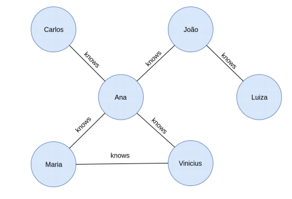

# grapho-api-test

Api em python async exemplificando uso de grafos - Exercicio

## Stack

- fastapi
- networkx
- docker
- pytest-cov
- python 3.8

## Dependencias

```bash
sudo python3 -m pip install -r requirements.txt --upgrade
```

## Diagrama do grafo



## Variaveis de ambiente

```bash
SWAGGER_DOCS=1 # deixa ativado a interface de swagger na api
```

## Executar

```bash
docker-compose up --build
```

## Pagina de acesso da api

swagger : `http://0.0.0.0:8080/docs`

## Testes

Executar com pytest, conforme comando abaixo:

```bash
pytest --cov=graphox tests/ --cov-fail-under=70 --disable-pytest-warnings
```
